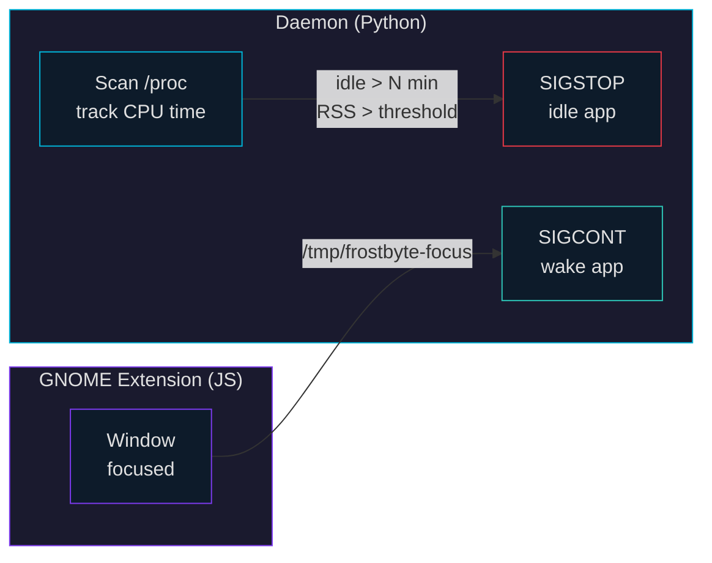

<h1 align="center">
  <br>
  
  <br>
  FrostByte
  <br>
</h1>

<h4 align="center">Your idle apps are wasting gigabytes of RAM. FrostByte fixes that.</h4>

<p align="center">
  <a href="https://github.com/VladislavTsytrikov/frostbyte/releases/latest"></a>
  <a href="LICENSE"></a>
  
  
  
  
</p>

<p align="center">
  <a href="#install">Install</a> &bull;
  <a href="#live-monitor">Live Monitor</a> &bull;
  <a href="#how-it-works">How It Works</a> &bull;
  <a href="#configuration">Configuration</a> &bull;
  <a href="#cli">CLI</a>
</p>

<p align="center">
  
</p>

---

## The Problem

Modern apps are hungry. Firefox, Slack, VS Code, Spotify sit on **4+ GB of RAM** while you're not looking at them. Linux won't reclaim pages that apps are technically "using" just by being alive.

## The Solution

**FrostByte** puts idle apps into cold storage:

1. **Freeze** — Idle apps above a RAM threshold get `SIGSTOP`. The kernel instantly reclaims their physical pages.
2. **Thaw** — Focus or click a frozen window — the GNOME extension fires `SIGCONT`. **Instant. Transparent.**

> [!TIP]
> Your system stays snappy, swap stays empty, battery lasts longer.

---

## Features

<table>
<tr><td width="40"><b>&#9889;</b></td><td><b>Instant Wake-up</b></td><td>Zero-latency thawing via native GNOME Shell extension</td></tr>
<tr><td><b>&#9608;</b></td><td><b>Live TUI</b></td><td>Real-time dashboard — frozen apps, candidates, RAM saved</td></tr>
<tr><td><b>&#9851;</b></td><td><b>Smart Thaw</b></td><td>Wakes entire process trees including child processes (TUI apps in terminals)</td></tr>
<tr><td><b>&#10052;</b></td><td><b>Auto-Freeze</b></td><td>Scans <code>/proc</code> for RAM-heavy apps idle beyond threshold</td></tr>
<tr><td><b>&#128433;</b></td><td><b>Mouse-Friendly</b></td><td>Click frozen windows to thaw, even without focus</td></tr>
<tr><td><b>&#9881;</b></td><td><b>Panel Indicator</b></td><td>GNOME top bar snowflake with live frozen count + quick-thaw menu</td></tr>
<tr><td><b>&#127760;</b></td><td><b>Bilingual</b></td><td>English / Russian — toggle with <code>L</code></td></tr>
<tr><td><b>&#128230;</b></td><td><b>Single File</b></td><td>One Python script. No deps. Daemon + TUI + extension + installer</td></tr>
</table>

---

## Install

```bash
curl -fsSL https://raw.githubusercontent.com/VladislavTsytrikov/frostbyte/main/install.sh | bash
```

> [!NOTE]
> One command. Downloads a single Python script and runs `frostbyte install` which sets up the daemon, GNOME Shell extension, and systemd service.

<details>
<summary><b>Alternative methods</b></summary>

<br>

**Direct download:**
```bash
curl -fsSL https://github.com/VladislavTsytrikov/frostbyte/raw/main/frostbyte -o /tmp/frostbyte
python3 /tmp/frostbyte install
```

**From source:**
```bash
git clone https://github.com/VladislavTsytrikov/frostbyte.git
cd frostbyte
python3 frostbyte install
```
</details>

<details>
<summary><b>Uninstall</b></summary>

<br>

```bash
frostbyte uninstall          # keeps config
frostbyte uninstall --purge  # removes everything
```
</details>

---

## Live Monitor

```bash
frostbyte monitor
```

| Key | Action |
|:---:|--------|
| `Up` `Down` | Navigate processes |
| `Enter` | Freeze / Thaw selected |
| `e` | Exclude from auto-freezing |
| `f` / `t` | Quick-search freeze / thaw by name |
| `Tab` | Switch tab: Frozen / Candidates / Exclusions |
| `L` | Toggle language (EN / RU) |
| `q` | Quit |

---

## How It Works



**What's in the box:**

```
frostbyte (single Python file)
├── daemon        — polls /proc, sends SIGSTOP / SIGCONT
├── TUI monitor   — curses dashboard with 3 tabs
├── GNOME ext     — embedded JS, tracks focused window PID
└── installer     — writes extension + systemd service from embedded resources
```

> [!IMPORTANT]
> **Self-coupling** — the daemon auto-enables the extension on startup. The extension auto-starts the daemon via systemd if not running. They can't get out of sync.

<details>
<summary><b>Freeze / thaw in detail</b></summary>

<br>

**Freeze cycle:** the daemon polls `/proc` every second, tracking CPU time per process. If a process with RSS above the threshold shows no CPU activity for N minutes, it gets `SIGSTOP`. The kernel reclaims the physical memory pages.

**Thaw cycle:** the GNOME Shell extension writes the focused window's PID to `/tmp/frostbyte-focus-$UID`. The daemon reads this file, finds the frozen ancestor *and* stopped descendants (for TUI apps inside terminals), and sends `SIGCONT`.

**Process tree awareness:** when you focus a terminal, FrostByte thaws both the terminal itself (ancestor search) and any stopped child processes like `vim`, `htop`, or `mc` inside it (descendant search).
</details>

---

## Configuration

`~/.config/frostbyte/config.json`

```jsonc
{
  "freeze_after_minutes": 10,    // idle time before auto-freeze
  "min_rss_mb": 100,             // minimum RSS to consider
  "scan_interval": 10,           // seconds between /proc scans
  "whitelist": ["chrome", "spotify"]  // your additions
}
```

| Option | Default | Description |
|--------|:-------:|-------------|
| `freeze_after_minutes` | `10` | Idle time before auto-freeze |
| `min_rss_mb` | `100` | Minimum RSS (MB) to consider freezing |
| `poll_interval` | `1` | Seconds between CPU polls |
| `scan_interval` | `10` | Seconds between full `/proc` scans |
| `max_freeze_hours` | `4` | Auto-thaw after this many hours |
| `whitelist` | `[]` | Extra process names to never freeze |

> [!NOTE]
> FrostByte ships with a built-in whitelist (gnome-shell, pipewire, terminals, systemd, etc.). Your `whitelist` entries are **merged** on top — you only need to add app-specific names.

---

## CLI

```
frostbyte run             start daemon (foreground)
frostbyte monitor         live TUI dashboard
frostbyte status          show frozen & candidate processes
frostbyte freeze <name>   manually freeze by name
frostbyte thaw [name]     thaw by name (or all)
frostbyte install         install everything
frostbyte uninstall       remove everything
```

---

## Alternatives

| | **FrostByte** | Nyrna | XSuspender |
|---|:---:|:---:|:---:|
| Wayland | **yes** | no | no |
| GNOME 45–48 | **yes** | yes | yes |
| Auto-freeze (RAM-aware) | **yes** | no | no |
| Instant thaw on focus | **yes** | no | yes |
| Child process thawing | **yes** | no | no |
| Zero dependencies | **yes** | no | yes |
| TUI dashboard | **yes** | no | no |
| Single file install | **yes** | no | no |

---

<p align="center">
  <a href="LICENSE">MIT License</a> &bull; Made for Linux desktops that deserve better memory management
</p>
